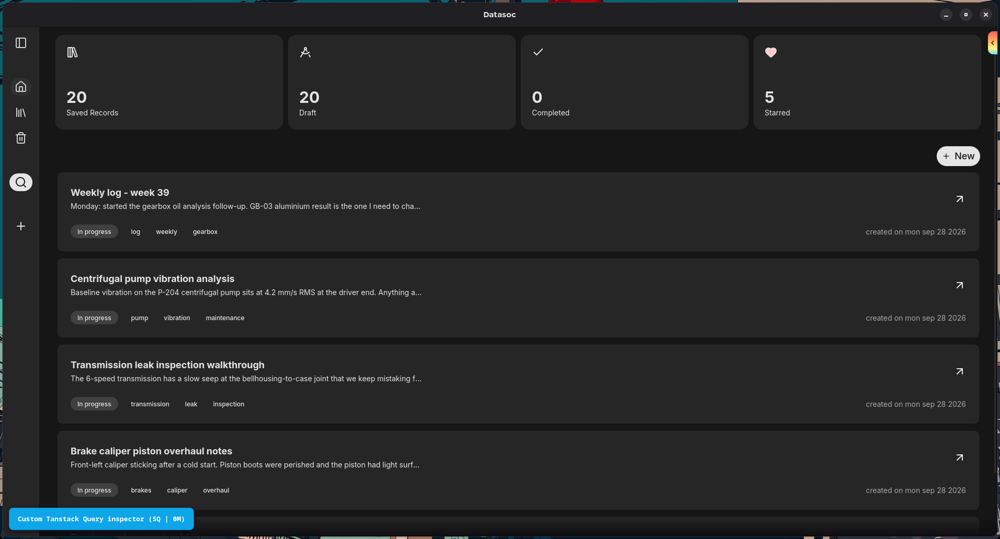

# Datasoc

> An intelligent knowledge retention engine — search your past knowledge by keywords, semantic, and intent.



## Features

- **Records, not files:** rich-text notes with tags, flags, favorites, trash — everything queryable
- **Hybrid search:** keyword (FTS5) + semantic vectors (MiniLM), fused with RRF ranking
- **100% local:** SQLite + on-device embeddings. No account, no cloud, no telemetry
- **Command palette:** global search and navigation from the keyboard
- **Offline-first:** no network, no problem

## Run it

No binaries yet — run from source:

```bash
bun install
bunx tauri dev         # desktop app (needs Rust toolchain)

# Does not support web, maybe in future with an external db, sqlite-vec on web isn't really what I am looking for
```

**Requirements:** Bun · Rust toolchain (Tauri only) · `src-tauri/res/minilm-l6.gguf`

### PLEASE READ

You can get `huoxu/all-MiniLM-L6-v2-Q8_0` (8 bit quantized, better performance less accuracy, mostly unnoticable): [Download link](https://huggingface.co/huoxu/all-MiniLM-L6-v2-Q8_0-GGUF/resolve/main/all-minilm-l6-v2-q8_0.gguf?download=true)

*Note: Ensure you rename to `minilm-16.gguf` and store it in `src-tauri/res/{name}`* I would make this so much easier later on. For now you can use just this embedding model to avoid mismatched dimensions or still you can edit the code and update your embedding's dimensions


## Scripts

| Command               | What              |
| --------------------- | ----------------- |
| `dev`                 | Vite dev server   |
| `build`               | Production build  |
| `preview`             | Preview the build |
| `format`/`lint`/`check` | Biome           |


## Building on Windows

### Prerequisites

1. **Rust:** Ensure you have Rust installed via [rustup](https://rustup.rs/).
2. **CMake:** Required for compiling native dependencies like `llama-cpp`.
   ```powershell
   winget install Kitware.CMake
   ```

### C++ Build Environment:

Native dependencies require C++ compilation tools. You can set this up using either method below:

Option A: Standalone C++ Build Tools (Recommended)

Download the Visual Studio Build Tools Installer.

```powershell
# Windows 10
# Source - https://stackoverflow.com/a/55053709

winget install Microsoft.VisualStudio.BuildTools --force --override "--wait --passive --add Microsoft.VisualStudio.Component.VC.Tools.x86.x64 --add Microsoft.VisualStudio.Component.Windows10SDK"

```
```powershell
# Windows 11
# Source - https://stackoverflow.com/a/55053709

winget install Microsoft.VisualStudio.BuildTools --force --override "--wait --passive --add Microsoft.VisualStudio.Component.VC.Tools.x86.x64 --add Microsoft.VisualStudio.Component.Windows11SDK.26100"

```

### LLVM

Download and install [LLVM](https://github.com/llvm/llvm-project/releases)

Ensure you download the embedding model and save it to src-tauri/res/

```powershell
bun tauri dev
```
